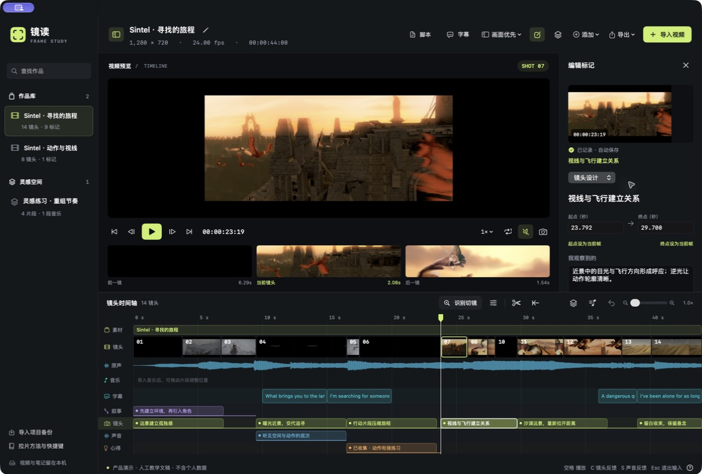
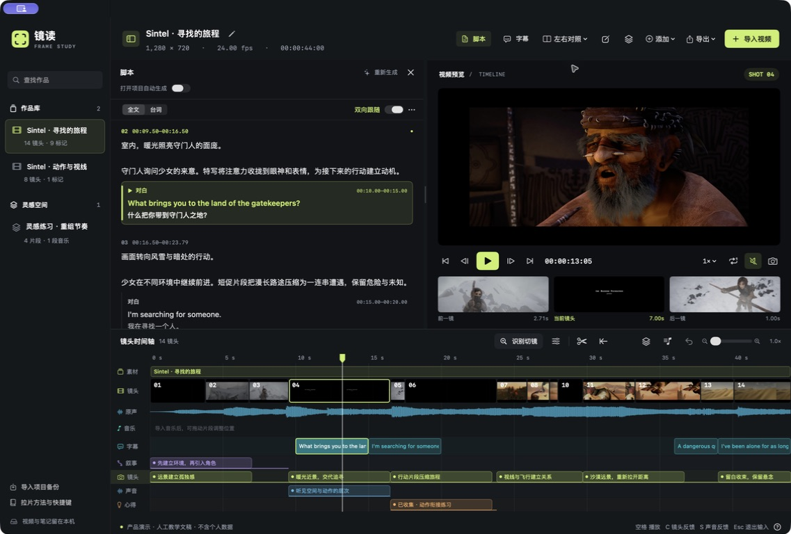
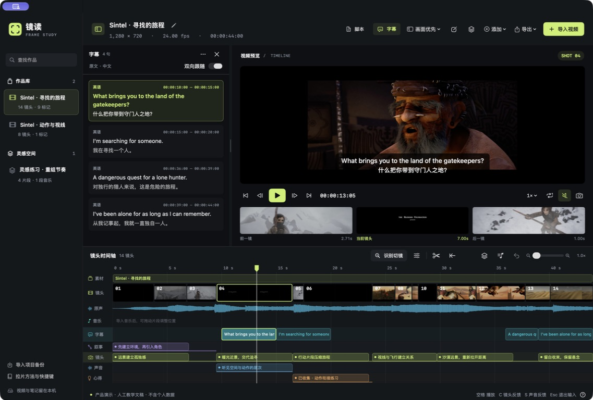
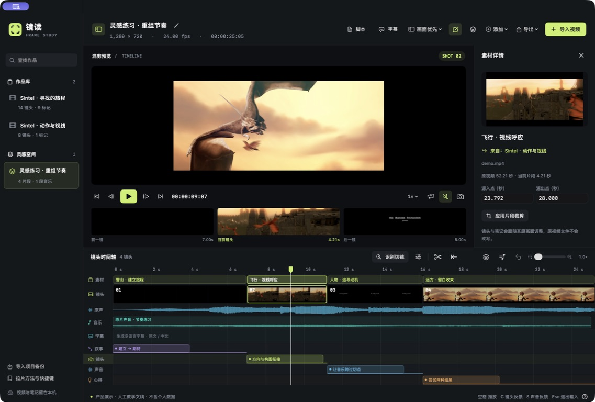

# 镜读 · Frame Study

把值得反复看的视频，变成自己的创作笔记。

镜读是一款 macOS 拉片学习工具，适合拆解 AI 短视频、广告和短片：对照镜头、脚本、字幕和声音，记录方法，再把想尝试的片段收进灵感空间做混剪练习。

当前为 **1.5.3 同事测试版**。支持 **Apple Silicon（arm64，M1 及更新芯片）和 macOS 14+**，暂不提供 Intel 版本。

[下载安装包](https://github.com/lareeyoung/jingdu/releases/tag/v1.5.3) · [看界面与用法](#用四个场景认识镜读) · [安装说明](Scripts/DISTRIBUTION.md)

## 用四个场景认识镜读

以下是镜读 **1.5.3 的真实界面截图**，使用独立演示项目。画面来自开放短片《Sintel》，脚本、中文译文和笔记为人工整理示例，用于展示操作流程，不代表 Seed 生成效果。[演示素材说明](docs/screenshots/README.md)

画面署名：© copyright Blender Foundation | [durian.blender.org](https://durian.blender.org/)，[CC BY 3.0](https://creativecommons.org/licenses/by/3.0/)。

### 1. 看懂一个镜头，从反复回看开始

逐帧回看、循环当前镜头，把构图、叙事与声音观察标在对应时间。前后镜头缩略图和原声波形放在一起，方便比较切换时机。



### 2. 把完整脚本放在画面旁边

一边看画面，一边读完整的故事、动作、对白与视听表达，也能切换到只看台词。阅读区支持画面优先、左右对照、上下对照，大小可以拖动调整。



### 3. 一句台词，对应一段画面

支持中、英、日、韩、西、法语；非中文附上中文译文，原文与中文分行显示，字幕保存在独立轨道。开启双向跟随后，播放会定位并高亮当前句，点击文字也能回到画面；字幕与脚本台词共用内容和时间。



### 4. 把收藏的灵感，做成自己的练习

从不同项目收集片段，在灵感空间调整顺序和起止位置，再加入音乐练习节奏。支持音乐裁剪、拆分、音量调整，以及导出包含音乐的混剪视频。



## 第一次使用，先完成一个小练习

1. **导入作品**：选择一段或多段视频，加入同一时间轴或分别建项目。项目名称可以单独修改，原视频文件名不变。
2. **边看边记**：逐帧回看，按 `C` 记镜头、按 `S` 记声音；需要时打开脚本或字幕对照。
3. **收集并练习**：选择一个镜头，或用 `I` / `O` 标记区间，收进灵感空间，调整顺序、加入音乐，再导出混剪。

本地播放、标记和笔记无需配置模型服务。生成字幕需要准备本地语音模型；中文翻译与脚本分析需要配置 Seed。

视频、项目与笔记保存在本机。视频脚本分析会向配置的服务发送所选视频和分析资料；中文翻译发送识别出的台词文本。发行包不包含用户的视频、作品库、账号、Key 或模型配置。

## 安装

1. 下载 `Jingdu-1.5.3-macOS-arm64.zip`，并同时取得该次发行的 `SHA256SUMS`、`RELEASE.json`。核对文件来自可信分享位置；校验方式见[安装与分发说明](Scripts/DISTRIBUTION.md)。
2. 解压，把 `镜读.app` 拖入“应用程序”，然后打开。
3. 首次需要生成字幕时，按下一节准备本地语音模型；播放和手动笔记无需这个模型。

**当前安装包采用 ad-hoc 测试签名，没有 Developer ID 签名或 Apple 公证。** macOS 可能提示开发者无法验证；在确认来源与文件校验后，可按 Apple 的说明查看“系统设置 → 隐私与安全性 → 仍要打开”。公司管理的 Mac 可能需要 IT 许可。项目不要求关闭 Gatekeeper、删除隔离标记或安装他人的签名证书。[Apple 安装说明](https://support.apple.com/zh-cn/102445)

## 字幕与脚本使用什么模型

人声识别由本机 **Whisper small 多语言模型，通过 whisper.cpp v1.8.3 运行**，支持中、英、日、韩、西、法语。**非中文的中文翻译由配置的 Seed 服务生成**；默认模型 ID 为 `doubao-seed-2-1-pro-260628`，请按服务提供方的实际名称填写。模型来源会记录在新字幕轨中。

字幕与脚本台词共用同一份识别结果、译文和时间；已有有效字幕会直接复用，脚本生成不重新抄写一套台词。语音转写和翻译可能需要人工校对。Seed 的画面分析不代表它已经听懂音乐或音效，声音设计描述仍需要回看片段核实。

### 首次下载本地模型

安装包带有识别引擎，**不带模型权重**。下载官方 [ggml-small.bin](https://huggingface.co/ggerganov/whisper.cpp/resolve/main/ggml-small.bin?download=true)（约 466 MiB），在镜读的字幕生成窗口选择已下载文件。应用会核验完整模型，不能使用 `small.en` 或其他改名文件。

也可以在解压后的安装包目录运行以下命令（需已有 Python 3）：

```sh
python3 Scripts/prepare-subtitle-engine.py --model-only
```

脚本会下载到 `~/Library/Application Support/Jingdu/SubtitleModels/ggml-small.bin` 并核验大小和官方 SHA-1。更多信息及可选镜像见[模型准备说明](Scripts/DISTRIBUTION.md#首次准备字幕模型)。日常运行不会自动下载模型。

### 配置 Seed 服务

在“模型设置”中填写自己的服务地址、AppID、Key 和模型 ID，再保存配置。接口需兼容本项目支持的供应商透传或 Chat Completions 请求方式。中转服务由使用者自行提供；仓库不预置私有接口、账号或配额。

Key 保存在当前 Mac 的钥匙串。普通请求使用静默读取及当前运行的缓存；需要系统授权时，可在设置中主动选择“授权读取已存 Key”。安装包不会包含作者的钥匙串或签名私钥。

## 从源码构建

需要 Apple Silicon Mac、macOS 14+、Apple Command Line Tools、Python 3.12+；首次编译字幕引擎还需要 CMake。源码不包含 `whisper-cli` 二进制或模型权重。

```sh
python3 Scripts/prepare-subtitle-engine.py --engine-only
python3 Scripts/package-release.py --check
python3 Scripts/package-release.py --output-dir ./dist/1.5.3
```

这会在临时目录编译同事测试版，输出源码 ZIP、arm64 安装 ZIP、发行记录和 SHA-256 校验文件，**不会替换当前安装版或访问本机签名身份**。输出目录必须是新目录。

`build.command` 默认保留本机开发版的固定身份签名流程；同事测试包使用上面的独立打包流程，无需每位使用者建立私有签名证书。有关源码复现、发行检查和正式 Developer ID 公证的边界，见[完整分发说明](Scripts/DISTRIBUTION.md)。

第三方识别引擎与模型的许可证、来源和校验信息位于 [Resources/SubtitleEngine](Resources/SubtitleEngine)。
